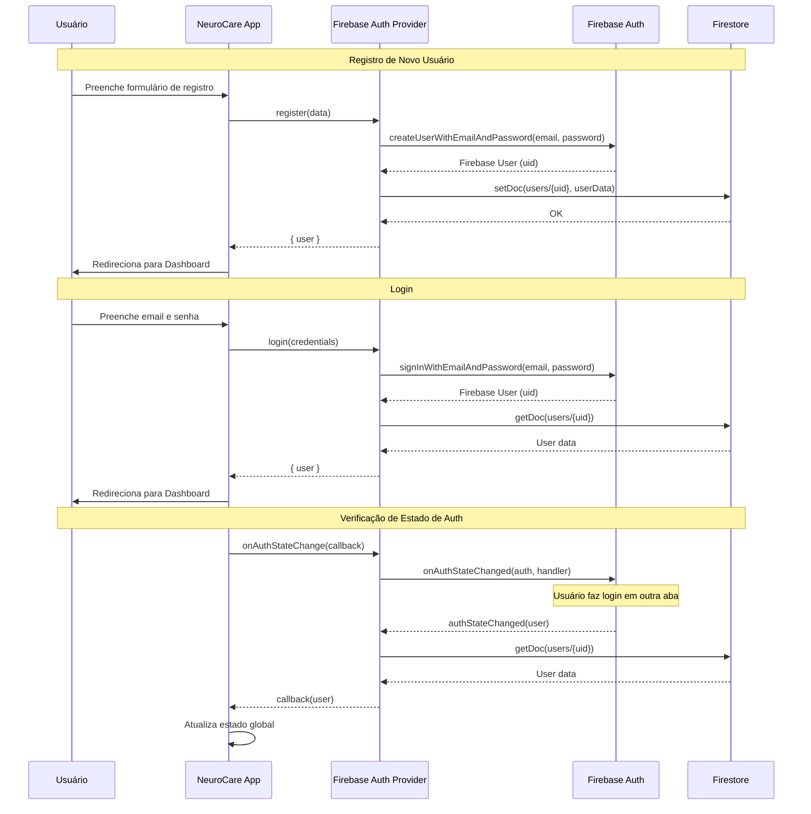
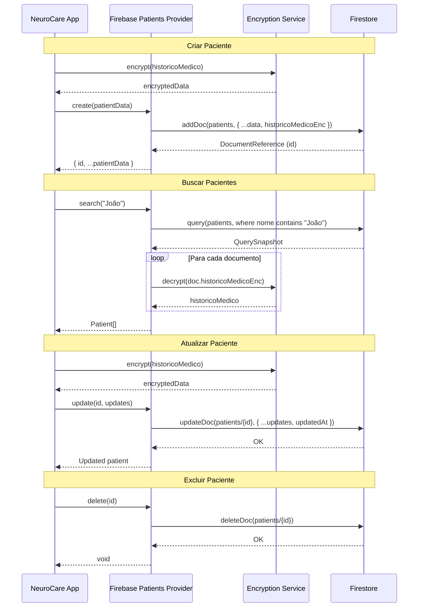
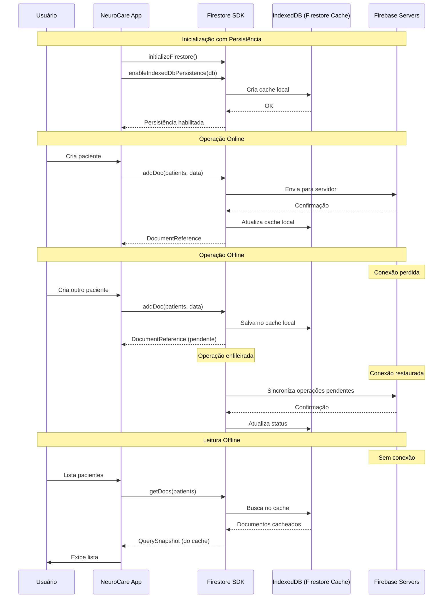
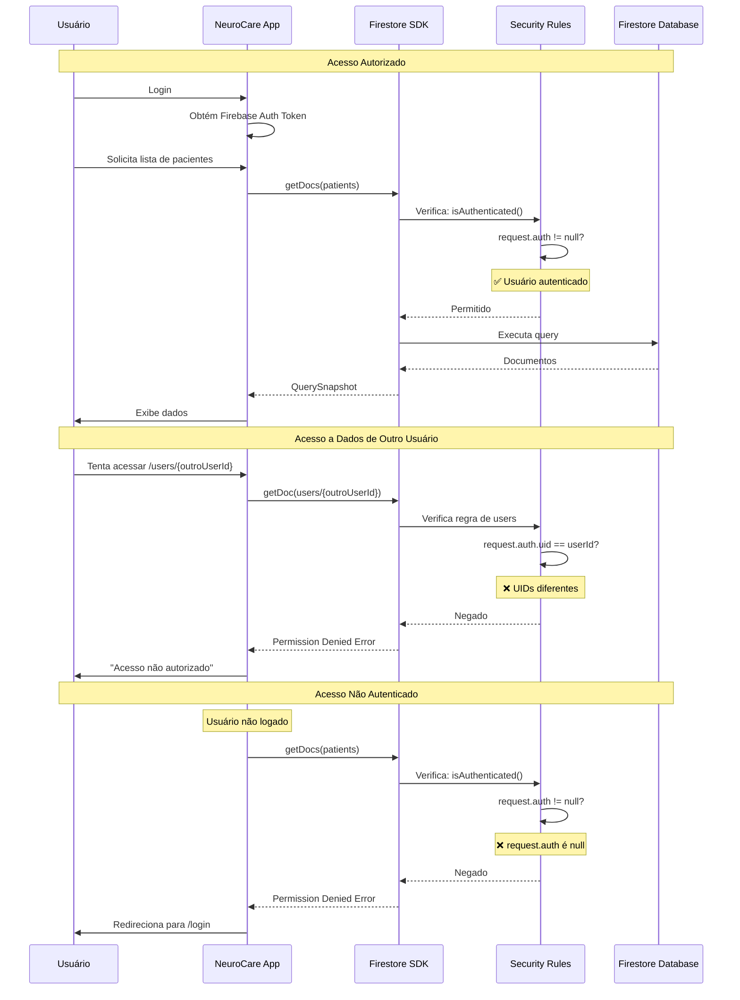

# Configuração do Firebase

## Criar Projeto no Firebase Console

1. Acesse [Firebase Console](https://console.firebase.google.com/)
2. Clique em "Adicionar projeto"
3. Dê um nome ao projeto (ex: neurocare-system)
4. Desabilite Google Analytics (opcional)
5. Clique em "Criar projeto"

## Configurar Firestore

1. No menu lateral, clique em "Firestore Database"
2. Clique em "Criar banco de dados"
3. Selecione "Iniciar no modo de produção"
4. Escolha a localização mais próxima (ex: southamerica-east1)
5. Clique em "Ativar"

## Configurar Authentication

1. No menu lateral, clique em "Authentication"
2. Clique em "Começar"
3. Na aba "Sign-in method", ative "E-mail/senha"
4. Clique em "Salvar"

## Obter Credenciais

1. No menu lateral, clique na engrenagem > "Configurações do projeto"
2. Role até "Seus apps" e clique no ícone da Web `</>`
3. Dê um nome ao app (ex: neurocare-web)
4. Copie as credenciais:

```javascript
const firebaseConfig = {
  apiKey: "AIza...",
  authDomain: "seu-projeto.firebaseapp.com",
  projectId: "seu-projeto",
  storageBucket: "seu-projeto.appspot.com",
  messagingSenderId: "123456789",
  appId: "1:123456789:web:abc123"
};
```

## Configurar Security Rules

1. No Firestore, clique na aba "Regras"
2. Cole as seguintes regras:

```javascript
rules_version = '2';
service cloud.firestore {
  match /databases/{database}/documents {
    function isAuthenticated() {
      return request.auth != null;
    }

    match /patients/{patientId} {
      allow read, write: if isAuthenticated();
    }
    match /evaluations/{evaluationId} {
      allow read, write: if isAuthenticated();
    }
    match /exams/{examId} {
      allow read, write: if isAuthenticated();
    }
    match /reports/{reportId} {
      allow read, write: if isAuthenticated();
    }
    match /users/{userId} {
      allow read, write: if isAuthenticated() && request.auth.uid == userId;
    }
  }
}
```

3. Clique em "Publicar"

## Estrutura de Coleções

```
firestore/
├── users/                    # Usuários do sistema
│   └── {userId}/
│       ├── email
│       ├── nome
│       ├── crm
│       └── ...
│
├── patients/                 # Pacientes
│   └── {patientId}/
│       ├── nome
│       ├── cpf
│       ├── historicoMedicoEnc  # Criptografado
│       └── ...
│
├── evaluations/              # Avaliações neurológicas
│   └── {evaluationId}/
│       ├── patientId
│       ├── mmseResultEnc       # Criptografado
│       ├── mocaResultEnc       # Criptografado
│       └── ...
│
├── exams/                    # Exames complementares
│   └── {examId}/
│
└── reports/                  # Relatórios
    └── {reportId}/
```

## GitHub Secrets

Configure os seguintes secrets no GitHub:

| Secret | Descrição |
|--------|-----------|
| `FIREBASE_API_KEY` | API Key do Firebase |
| `FIREBASE_AUTH_DOMAIN` | Auth Domain |
| `FIREBASE_PROJECT_ID` | Project ID |
| `FIREBASE_STORAGE_BUCKET` | Storage Bucket |
| `FIREBASE_MESSAGING_SENDER_ID` | Messaging Sender ID |
| `FIREBASE_APP_ID` | App ID |
| `FIREBASE_SERVICE_ACCOUNT` | Service Account JSON (para deploy) |
| `ENCRYPTION_KEY` | Chave de criptografia (32+ chars) |

## Configurar Service Account para Deploy

Para o deploy automático via CI/CD, você precisa criar uma Service Account:

1. Acesse o [Google Cloud Console](https://console.cloud.google.com/)
2. Selecione seu projeto Firebase
3. Vá para **IAM & Admin** > **Service Accounts**
4. Clique em **Create Service Account**
5. Nome: `github-actions-deploy`
6. Clique em **Create and Continue**
7. Adicione os roles:
   - `Firebase Hosting Admin`
   - `Cloud Run Viewer`
   - `Service Account User`
8. Clique em **Done**
9. Na lista de service accounts, clique nos 3 pontos > **Manage keys**
10. **Add Key** > **Create new key** > **JSON**
11. Salve o arquivo JSON
12. Copie o conteúdo completo do JSON e adicione como secret `FIREBASE_SERVICE_ACCOUNT` no GitHub

## Ambientes de Deploy

O projeto tem dois ambientes de deploy:

### 1. GitHub Pages (IndexedDB)
- **URL**: `https://sistemamedicoufpe.github.io/Projeto-BFD/`
- **Provider**: IndexedDB (offline-only)
- **Uso**: Demo, testes, desenvolvimento
- **Dados**: Armazenados localmente no navegador

### 2. Firebase Hosting (Firebase)
- **URL**: `https://<project-id>.web.app/`
- **Provider**: Firebase (Firestore + Auth)
- **Uso**: Produção
- **Dados**: Sincronizados na nuvem

```
┌─────────────────────────────────────────────────────────────┐
│                      CI/CD Pipeline                          │
├─────────────────────────────────────────────────────────────┤
│                                                              │
│  ┌─────────────┐    ┌─────────────────────────────────────┐ │
│  │   Lint      │───>│  Build GitHub Pages (IndexedDB)     │ │
│  └─────────────┘    └──────────────┬──────────────────────┘ │
│         │                          │                         │
│         │           ┌──────────────▼──────────────────────┐ │
│         │           │  Deploy to GitHub Pages              │ │
│         │           │  https://...github.io/Projeto-BFD/   │ │
│         │           └─────────────────────────────────────┘ │
│         │                                                    │
│         │           ┌─────────────────────────────────────┐ │
│         └──────────>│  Build Firebase (Firebase Provider) │ │
│                     └──────────────┬──────────────────────┘ │
│                                    │                         │
│                     ┌──────────────▼──────────────────────┐ │
│                     │  Deploy to Firebase Hosting          │ │
│                     │  https://<project>.web.app/          │ │
│                     └─────────────────────────────────────┘ │
│                                                              │
└─────────────────────────────────────────────────────────────┘
```

## Diagramas de Sequência

### Autenticação Firebase



### CRUD de Pacientes no Firestore



### Persistência Offline do Firestore



### Fluxo de Segurança (Security Rules)


